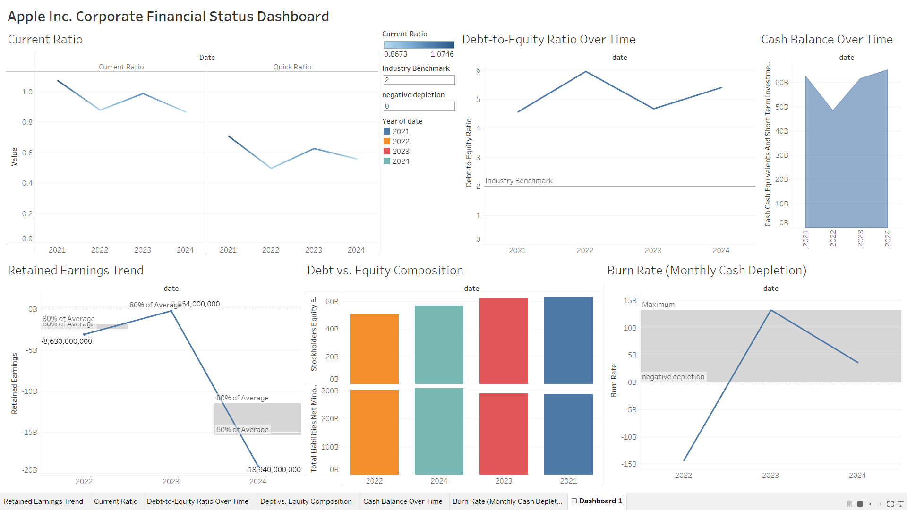

# Apple Inc. Corporate Financial Status Dashboard

This Tableau dashboard provides a comprehensive analysis of Apple Inc.'s financial health from 2021 to 2024. It includes key metrics such as liquidity ratios, debt-to-equity trends, cash balance, retained earnings, debt vs. equity composition, and burn rate. The dashboard is designed to help stakeholders quickly assess Apple's financial performance and identify areas of strength or concern.

---

## Project Overview
The "Apple Inc. Corporate Financial Status Dashboard" visualizes critical financial data across six sections:
- **Current Ratio Gauge**: Tracks Apple's ability to meet short-term obligations with a current ratio of 0.8673 and a quick ratio of 0.0746.
- **Debt-to-Equity Ratio Over Time**: Compares Apple's leverage against an industry benchmark of 2.0, showing a consistent trend above this mark.
- **Cash Balance Over Time**: Displays trends in Apple's cash reserves, peaking at 60B in 2024.
- **Retained Earnings Trend**: Highlights a sharp decline in retained earnings to -19.94B by 2024.
- **Debt vs. Equity Composition**: Illustrates the balance between debt and equity financing, with debt peaking in 2023.
- **Burn Rate (Monthly Cash Depletion)**: Monitors cash outflow patterns, showing volatility with a peak in 2023.

These visualizations provide a holistic view of Apple's financial status, making it easier to spot trends, risks, and opportunities.

---

## How to Use
1. **Download the Tableau Workbook**:
   - Download `Apple_Financial_Dashboard.twbx` from this repository.
2. **Open in Tableau**:
   - Open the file in [Tableau Desktop](https://www.tableau.com/products/desktop) (version 2021.1 or later).
3. **Interact with the Dashboard**:
   - Use the navigation tabs at the bottom to explore individual visualizations.
   - Hover over data points for detailed information.
4. **Optional: Explore the Data**:
   - If you'd like to examine the raw data, check the `data/` folder for the source files.

---

## Dashboard Preview
Below is a preview of the dashboard:

*Note: For the full interactive experience, open the workbook in Tableau Desktop.*

---

## Data Sources
- **Financial Data**: Sourced from Apple Inc.'s publicly available financial statements (2021-2024).
- **Benchmarks**: Industry benchmarks for debt-to-equity ratios are included for comparison.

*Raw data files are available in the `data/` folder for reference, if not embedded in the .twbx file.*

---

## Key Insights
- **Liquidity**: Apple's current ratio of 0.8673 is below 1.0, signaling potential short-term liquidity risks, though its cash balance may mitigate this.
- **Leverage**: The debt-to-equity ratio remains above the industry benchmark of 2.0, indicating higher financial risk but potentially strategic use of debt.
- **Cash Reserves**: Apple's cash balance shows a general upward trend, with a significant spike to 60B in 2024.
- **Retained Earnings**: A decline to -19.94B by 2024 raises concerns about profitability or dividend policies.
- **Burn Rate**: A volatile burn rate in 2023 (peaking at 15B) suggests significant cash outflows, warranting further investigation.

---

## Repository Structure
- **`data/`**: Contains the raw financial data used in the dashboard (optional if embedded in the .twbx file).
- **`docs/`**: Folder for additional documentation or reports.
- **`images/`**: Stores screenshots of the dashboard for quick previews.
- **`Apple_Financial_Dashboard.twbx`**: The main Tableau workbook file.
- **`README.md`**: Project overview and instructions.
- **`LICENSE.md`**: License details for the project.

---

## Requirements
- **Tableau Desktop**: Version 2021.1 or later.
- **Data Files**: If using external data, ensure the files in `data/` are linked correctly in Tableau.

---

## License
This project is licensed under the [MIT License](LICENSE.md). You are free to use, modify, and share this work, provided you give appropriate credit.